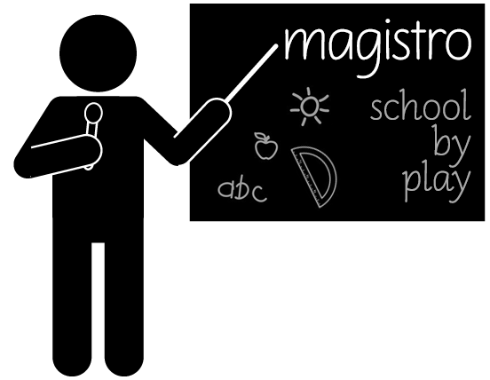

# Magistro

Simple Python application for testing kids in the following areas:
* math - subtraction
* math - addition
* math - multiplication
* math - division
* physics - time units (experimental) 